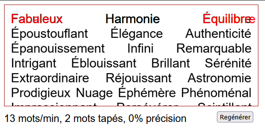

# fastype secure entry

**[Fastype](https://fastype.app)** is an online game where players type displayed words as quickly as possible, created by [MathieuMarthy](https://github.com/MathieuMarthy) & [syysy](https://github.com/syysy). Currently, the game’s security is not very strong 😅: the backend sends the list of words to the frontend (client-side), then the score is calculated and sent back to the backend. To cheat, one could simply resend the request with a modified score. This is why this project (fastype-secure-entry) exists—it demonstrates a more secure implementation of the game.  

This project implements two main levels of security:  

- **Image**: instead of sending a simple list of words as text, we generate an image containing random words and send it to the frontend. The data sent includes only the image, the positions of words in the image, and a hash for each step of typing the word. This way, the user can know when they make a mistake without being able to see the word in plain text.

```json
{
    "data":[
        {
            "line":0,
            "word_part_hash": [
                "44bd7ae60f478fae1061e11a7739f4b94d1daf917982d33b6fc8a01a63f89c21",
                "72aa80bf1ac4eef0263917c350d8941a1c3f90b3b50d1232b52e6ceda51d53d4",
                ..., 
                "84efb34057239ad03aece5356597fd0f06051ed6be85ed068fac698732085af0"
            ],
            "x":0.025,
            "y":0.026845637583892617
        },
        ...
    ],
    "image":"/static/image/temp/t4JdhPqEsk81.png",
    "image_h":800,
    "image_w":745
}
```
`word_part_hash`: is the hash of each step of writing the word, example for the word "Bonjour": `["B", "Bo", "Bon", "Bonj", "Bonjo", "Bonjou", "Bonjour"]`
- **Websocket**: the websocket protocol allows bidirectional communication between the client and the server. In our case, it sends each typed letter to the server so that (in a future version) we can verify that the user is not a bot by analyzing the time intervals between letters. Additionally, the server can calculate the user’s score in real-time.

### Next version

In a future version, I plan to add a unique code sent alongside each letter to prevent tampering.

## Demo

`pip install -r requirements.txt`

`python server.py`


